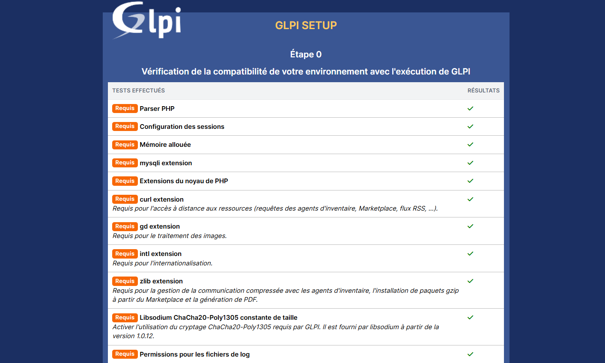
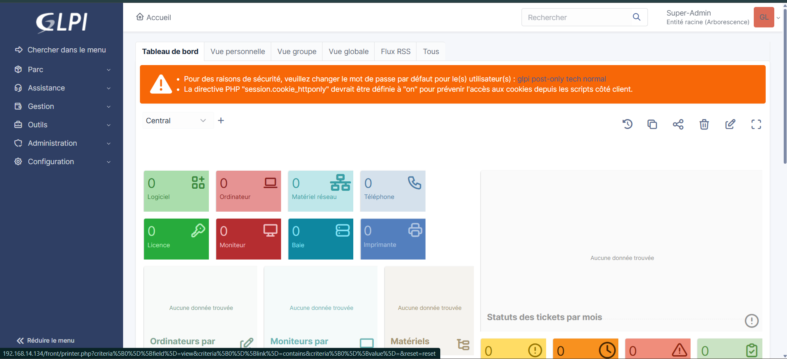
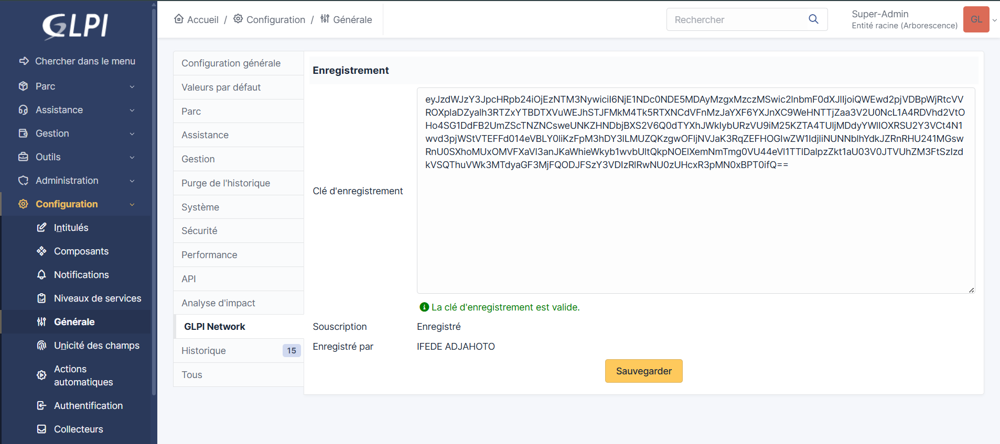
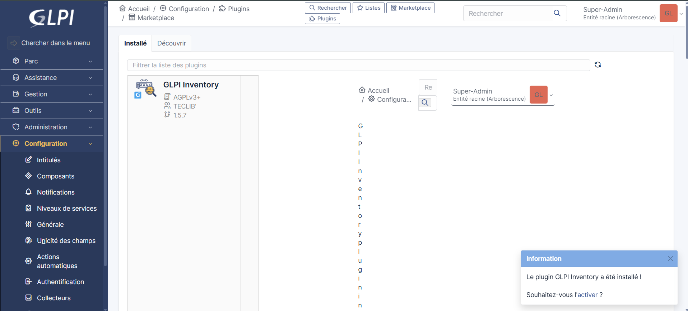
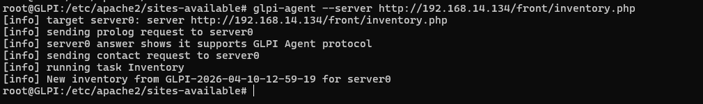
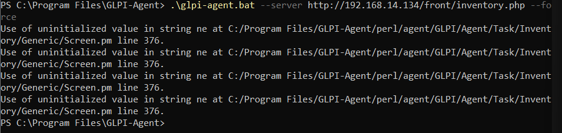
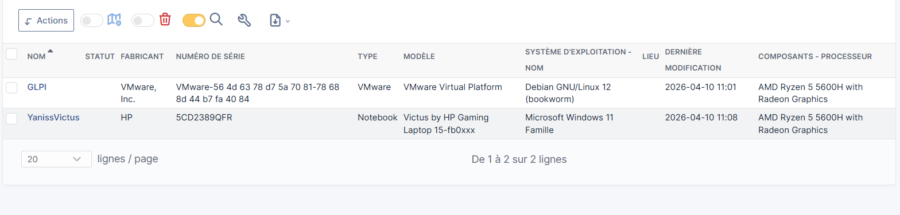

# Bloc 1 : Gérer le patrimoine informatique
## C1 : Recensement du parc informatique avec GLPI
### Objectifs
* Recenser et identifier toutes les ressources numériques du groupe (machines hôtes et VM).
* Travailler en mode gestion de projet.
Exporter et présenter l’inventaire final via GLPI.
### Configuration des machines
* Crée 1 VM sur son ordinateur.
* L'ordinateur hôte est également inventorié.
* Total : 2 machines (1 hôte + 1 VM).
* La machine servira de serveur GLPI.
### Agents GLPI
* Installer l’agent GLPI sur toutes les machines (hôte + VM).
* Lancer les inventaires vers le serveur GLPI.

### Etapes
#### Installation automatique de GLPI
* Crée un fichier installglpi.sh exécutable avec les droits nécessaires.
* Copier à l'intérieur le script suivant :
        
        #!/bin/bash

        echo "=== Installation automatique de GLPI ==="

        # Variables
        GLPI_VERSION="10.0.20"
        DB_NAME="glpi"
        DB_USER="glpiuser"
        DB_PASS="admin"
        SERVER_NAME="glpi.localhost"

        # Mise à jour du système
        apt update && apt -y upgrade

        # Installation Apache
        apt install -y apache2
        systemctl enable apache2
        systemctl start apache2

        # Installation dépendances PHP
        apt install -y lsb-release ca-certificates apt-transport-https curl

        curl -sSLo /tmp/debsuryorg-archive-keyring.deb https://packages.sury.org/debsuryorg-archive-keyring.deb
        dpkg -i /tmp/debsuryorg-archive-keyring.deb
        echo "deb https://packages.sury.org/php/ $(lsb_release -sc) main" > /etc/apt/sources.list.d/php.list

        apt update

        apt install -y php8.3 php8.3-cli php8.3-common php8.3-mysql php8.3-gd php8.3-intl \
        php8.3-xml php8.3-mbstring php8.3-curl php8.3-zip php8.3-bz2 php8.3-ldap \
        php8.3-opcache php8.3-exif

        # Redémarrage Apache
        systemctl restart apache2

        # Installation MariaDB
        apt install -y mariadb-server
        systemctl enable mariadb
        systemctl start mariadb

        # Création base de données GLPI
        mysql <<EOF
        CREATE DATABASE $DB_NAME CHARACTER SET utf8mb4 COLLATE utf8mb4_unicode_ci;
        CREATE USER '$DB_USER'@'localhost' IDENTIFIED BY '$DB_PASS';
        GRANT ALL PRIVILEGES ON $DB_NAME.* TO '$DB_USER'@'localhost';
        FLUSH PRIVILEGES;
        EOF

        # Téléchargement GLPI
        cd /tmp
        wget https://github.com/glpi-project/glpi/releases/download/$GLPI_VERSION/glpi-$GLPI_VERSION.tgz

        # Décompression
        tar -xvzf glpi-$GLPI_VERSION.tgz
        mv glpi /var/www/

        # Droits Apache
        chown -R www-data:www-data /var/www/glpi
        chmod -R 755 /var/www/glpi

        # Activation rewrite Apache
        a2enmod rewrite

        # Virtual Host GLPI
        cat <<EOF > /etc/apache2/sites-available/glpi.conf
        <VirtualHost *:80>
            ServerName $SERVER_NAME
            DocumentRoot /var/www/glpi/public

            <Directory /var/www/glpi/public>
                Require all granted
                RewriteEngine On
                RewriteCond %{REQUEST_FILENAME} !-f
                RewriteRule ^(.*)$ index.php [QSA,L]
            </Directory>
        </VirtualHost>
        EOF

        a2ensite glpi.conf
        a2dissite 000-default.conf

        # Sécurisation cookies PHP
        sed -i 's/;session.cookie_httponly =/session.cookie_httponly = On/' /etc/php/8.3/apache2/php.ini

        # Redémarrage Apache
        systemctl reload apache2

        echo "=== Installation terminée ==="
        echo "Accède à GLPI via : http://$(hostname -I | awk '{print $1}')"
        echo "Base de données : $DB_NAME"
        echo "Utilisateur DB : $DB_USER"

#### Configuration
* On ouvre un navigateur et on entre notre adresse IP. On obtient cette interface

* On choisit Français puis on clique sur OK puis sur continuer et installer. On arrive à cette étape

* On installe les modules manquants avec :

        sudo apt install php-intl -y
        sudo systemctl restart apache2

* Une fois que tout est ok, on clique sur continuer et on renseigne glpi.localhost comme hôte, et on utilise glpiuser ainsi que le mot de passe qu’on a configuré précédemment.

* On se connecte avec les identifiants :
Id : glpi
Mdp : glpi
 Et on arrive sur l'interface de GLPI

 

* On change les password de tous les Utilisateurs 

* On modifie le fichier : /etc/php/8.3/apache2/php.ini et on met session.cookie_httponly = On

#### Recensement

* On commence d'abord par installé GLPI Inventory en allant dans le marketplace, en s'enregistrant puis en récupérant la clé d'enrengistrement

* On télécharge puis installe GLPI Inventory puis on l'active.

* Une fois GLPI Inventory installé on installe l'agent GLPI sur Linux et Windows

        Linux
        wget https://github.com/glpi-project/glpi-agent/releases/download/1.17/glpi-agent-1.17-linux-installer.pl
        chmod +x glpi-agent-1.17-linux-installer.pl
        ./glpi-agent-1.17-linux-installer.pl

        Windows
        Via cette url : https://github.com/glpi-project/glpi-agent/releases

* On peut maintenant lancé un inventaire

        Linux 
        glpi-agent --server http://IP_DU_SERVEUR/front/inventory.php

        Windows
        .\glpi-agent.bat --server http://192.168.14.134/front/inventory.php 
        Completé --force si nécéssaire

* On voit que les machines ont été bien Inventorié !!!

