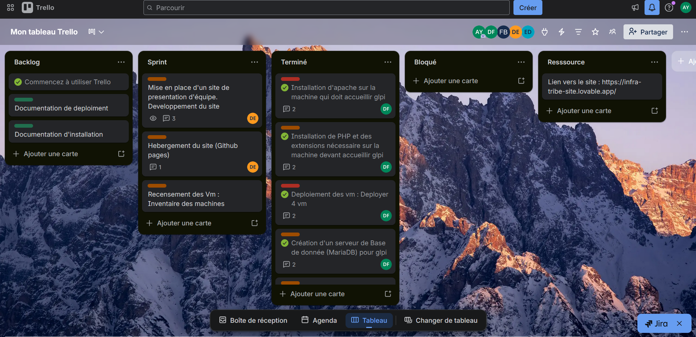

# Bloc 4 : Mettre à disposition des utilisateurs un service informatique
## C14 : Mettre en place un Trello et plannifier les tâches grâce à la méthode Kanban 

### Méthode Kanban

La méthode Kanban est une méthode de gestion de projet qui repose sur l’organisation et la visualisation du travail. Elle permet de suivre l’avancement des tâches de manière simple et efficace.

Le principe est d’utiliser un tableau divisé en plusieurs colonnes représentant les étapes du processus, comme « à faire », « en cours » et « terminé ». Chaque tâche est représentée par une carte. Au fur et à mesure de son avancement, cette carte est déplacée d’une colonne à une autre, ce qui permet d’avoir une vue globale et instantanée de l’état du travail.

Un aspect essentiel de cette méthode est la limitation du nombre de tâches en cours. Cela évite de disperser les efforts, réduit les erreurs et permet de se concentrer sur les priorités. En limitant le travail simultané, les équipes gagnent en efficacité et en qualité.

La méthode Kanban permet également d’identifier rapidement les blocages dans un projet. Si une colonne « en cours » est surchargée ou si des tâches n’avancent pas, cela devient immédiatement visible, ce qui facilite la prise de décision et l’amélioration continue du processus.

À l’origine, cette méthode a été développée par l’entreprise Toyota pour optimiser sa production industrielle. Aujourd’hui, elle est largement utilisée dans le domaine informatique et s’intègre dans les méthodes agiles, notamment pour la gestion de projets et le suivi des tâches au quotidien.

### Application de la méthode Kanban

Dans le cadre d’un hackathon, nous avons travaillé en équipe sur un projet informatique avec un temps limité. Pour organiser efficacement les tâches et suivre l’avancement, nous avons utilisé un tableau basé sur la méthode Kanban via Trello.

Ce tableau nous a permis de répartir les tâches, de visualiser leur progression (à faire, en cours, terminé) et de mieux coordonner le travail en équipe malgré la contrainte de temps.

