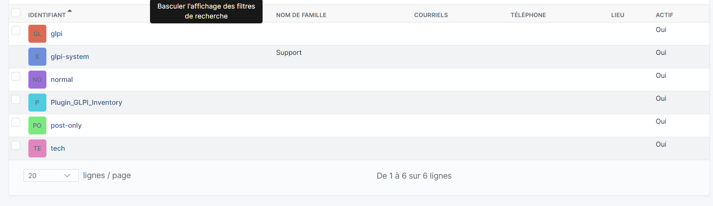
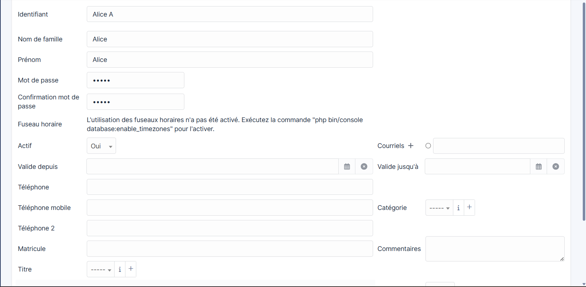
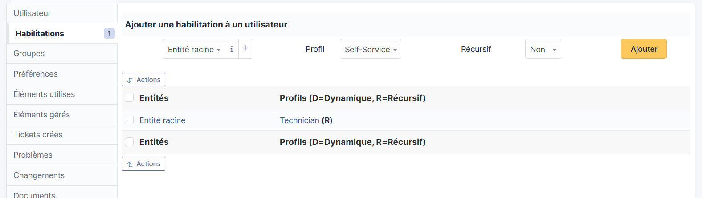
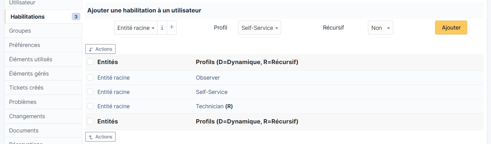
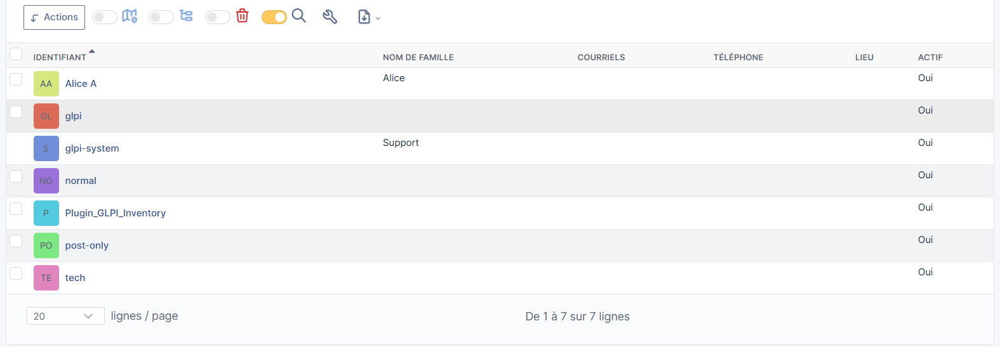

# Bloc 1 : Gérer le patrimoine informatique
## C3 : Gérer les niveaux d'habilitations (droits) sur GLPI

## Contexte

Dans GLPI, les **habilitations** permettent de définir ce que chaque utilisateur peut faire ou voir. Chaque utilisateur se voit attribuer un **profil** sur une **entité** donnée. Cette gestion des droits est essentielle pour sécuriser l'accès aux données et respecter les responsabilités de chacun.

## Les profils disponibles dans GLPI

| Profil | Description |
|---|---|
| **Super-Admin** | Accès total à toutes les fonctionnalités |
| **Admin** | Administration complète sauf configuration globale |
| **Technician** | Gestion des tickets, du parc et des interventions |
| **Observer** | Lecture seule sur l'ensemble du parc |
| **Self-Service** | Accès au portail utilisateur uniquement |
| **Post-only** | Création de tickets uniquement |

## Étape 1 — Accéder à la liste des utilisateurs

Depuis le menu principal : **Administration → Utilisateurs**

La liste affiche tous les comptes existants avec leur identifiant, nom, courriel et statut actif.

## Étape 2 — Ajouter un utilisateur

Cliquez sur Ajouter un utilisateur

La fiche utilisateur s'affiche avec toutes les champs d'informations : identifiant, nom, prénom, mot de passe, statut actif, etc. Remplir et crée l'utilisateur.

## Étape 3 — Accéder à l'onglet Habilitations

Dans le menu latéral gauche, cliquez sur **Habilitations**.

Cet onglet affiche les profils actuellement attribués à l'utilisateur sur chaque entité.

## Étape 4 — Ajouter une nouvelle habilitation

Pour ajouter un profil supplémentaire à l'utilisateur, utilisez le formulaire en haut de la section **Habilitations** :

- **Entité** → `Entité racine`
- **Profil** → choisissez le profil souhaité (ex: `Observer`)
- **Récursif** → `Non` ou `Oui` selon si le profil doit s'appliquer aux sous-entités

Cliquez ensuite sur **Ajouter**.

## Étape 5 — Résultat après ajout de plusieurs profils

Après avoir ajouté plusieurs habilitations, l'utilisateur Alice dispose de trois profils :

- **Observer** sur l'Entité racine
- **Self-Service** sur l'Entité racine
- **Technician (R)** sur l'Entité racine (récursif)

## Étape 6 — Vérifier dans la liste des utilisateurs

De retour dans **Administration → Utilisateurs**, on constate que l'utilisateur **Alice A** apparaît bien dans la liste avec son compte actif.

## Bonnes pratiques

- Attribuez toujours le **profil le moins privilégié** nécessaire pour le rôle de l'utilisateur.
- Utilisez le mode **Récursif** uniquement si l'utilisateur doit accéder à toutes les sous-entités.
- Évitez de donner le profil **Super-Admin** à plusieurs utilisateurs.
- Supprimez les habilitations inutiles via **Actions → Supprimer** dans l'onglet Habilitations.
