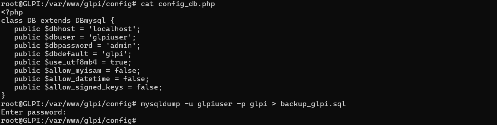
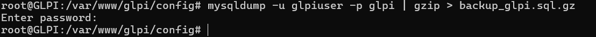
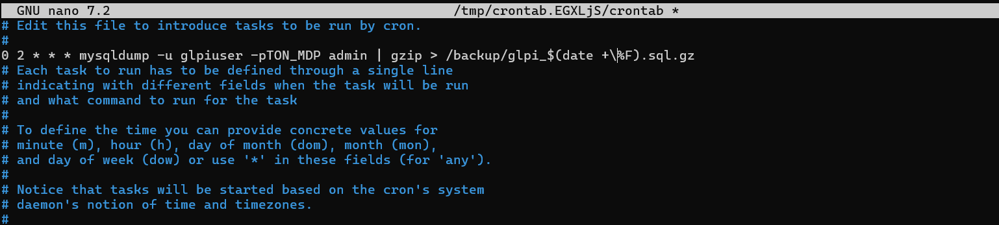

# Bloc 1 : Gérer le patrimoine informatique

## C5 : Réaliser des backups(sauvegardes) de la base de données de GLPI

### Objectif
Sauvegarder et restaurer une base de données.
### Conditions préalables
Avoir un serveur GLPI opérationnel.
### Considérations techniques
La sauvegarde des données de la base MySQL de GLPI est indispensable. Cela
peut se faire manuellement ou de manière automatique en planifiant les sauvegardes.
### Etapes

#### Manuellement

*  Identifier les infos de la base GLPI

    Dans le serveur, regarder le fichier :

        /var/www/glpi/config/config_db.php

    On y trouveras :

    nom de la base (dbdefault)
    utilisateur (dbuser)
    mot de passe (dbpassword)

*  Commande de sauvegarde :

        mysqldump -u utilisateur -p nom_base > sauvegarde_glpi.sql

        Compréssé (Recommandé)
        mysqldump -u utilisateur -p nom_base | gzip > backup_glpi.sql.gz

#### Automatiser

* Pour automatiser tous les jours à 2h :

        crontab -e

        Ajoute :

        0 2 * * * mysqldump -u utilisateur -pTON_MDP nom_base | gzip > /backup/glpi_$(date +\%F).sql.gz

#### Où se trouve ta sauvegarde ?

La sauvegarde est enregistrée exactement là où on a taper la commande.

### Restauration

    mysql -u utilisateur -p nom_base < backup_glpi.sql

    ou avec gzip :

    gunzip < backup_glpi.sql.gz | mysql -u utilisateur -p nom_base