# Bloc 2 : Répondre aux incidents et aux demandes d’assistance et d’évolution 
## C5 : Paramétrer la gestion de tickets sur GLPI

## Contexte

Ce TP a pour objectif de mettre en place une gestion complète des tickets dans GLPI en suivant les bonnes pratiques ITIL. Il couvre la création des utilisateurs, des entités, des catégories et des règles d'affectation automatique.


## Partie 1 — Préparation : nettoyage des utilisateurs par défaut

Avant de commencer, il est recommandé de supprimer les comptes inutiles pour sécuriser l'application.

**Administration → Utilisateurs**

Les utilisateurs à **conserver** sont :
- `glpi`
- `glpi-system`
- `Plugin_GLPI_Inventory`

Les comptes `normal`, `post-only` et `tech` peuvent être supprimés ou désactivés.

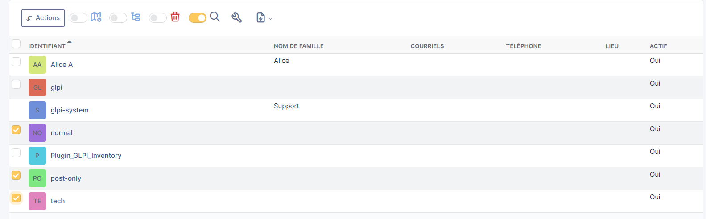

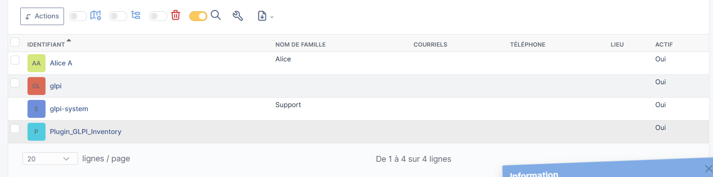


## Partie 2 — Niveau 1 : Créer les premiers utilisateurs

### 2.1 — Créer le technicien TechnicienParis

**Administration → Utilisateurs → Ajouter**

| Champ | Valeur |
|---|---|
| **Identifiant** | `TechParis` |
| **Nom de famille** | `TechnicienParis` |
| **Prénom** | `TechnicienParis` |
| **Mot de passe** | `Admin1234!` |
| **Actif** | `Oui` |

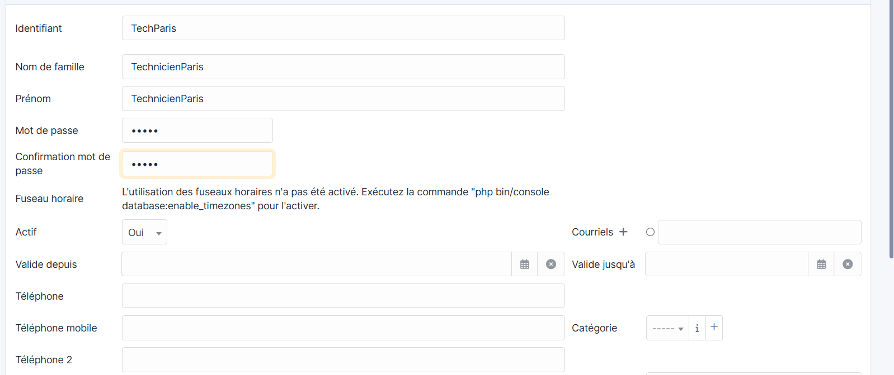


### 2.2 — Créer les employés Self-Service

De la même façon, créer les utilisateurs `employéParis1` et `employéParis2` avec le profil **Self-Service**.

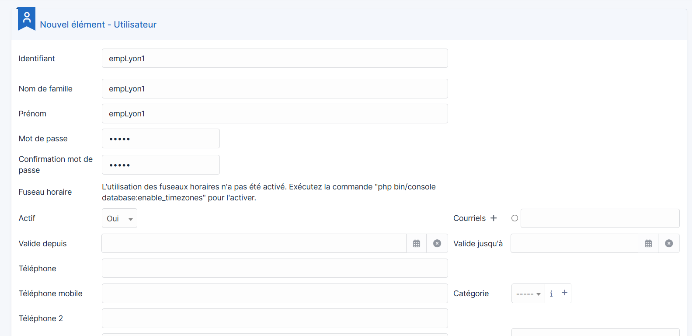


## Partie 3 — Niveau 2 : Créer l'entité Paris

### 3.1 — Créer l'entité

**Administration → Entités → Ajouter**

| Champ | Valeur |
|---|---|
| **Nom** | `Paris` |
| **Comme enfant de** | `Entité racine` |
| **Commentaires** | `Paris` |

Cliquer sur **Ajouter**.

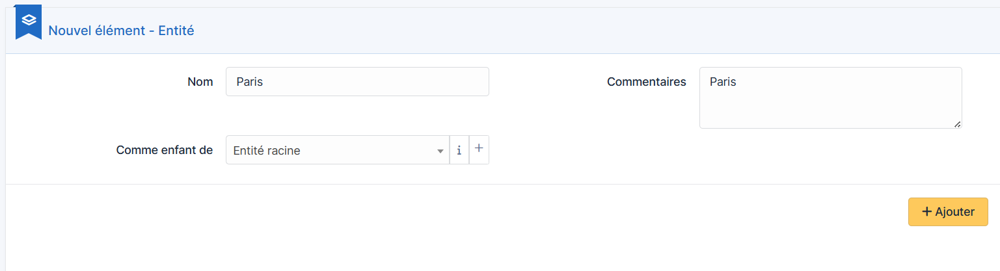


### 3.2 — Vérifier les entités créées

Après avoir créé les entités Paris et Lyon, la liste doit afficher :
- Entité racine
- Entité racine > Lyon
- Entité racine > Paris


### 3.3 — Rattacher les utilisateurs à l'entité Paris

Pour chaque utilisateur Paris, aller dans **Habilitations** et assigner l'entité **Paris** avec le profil correspondant.


## Partie 4 — Niveau 3 : Entité Lyon et tickets

### 4.1 — Créer les utilisateurs Lyon

Créer les techniciens `techLyon1`, `techLyon2` et les employés `empLyon1`, `empLyon2`, `empLyon3` rattachés à l'entité **Lyon**.

### 4.2 — Connexion avec un employé Paris

Se déconnecter puis se connecter avec `employéParis1`. Le portail Self-Service s'affiche avec la liste des tickets.

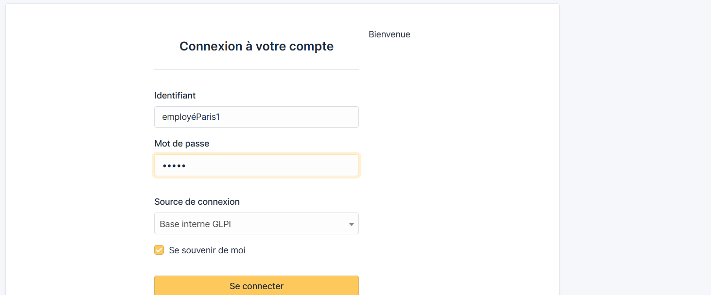

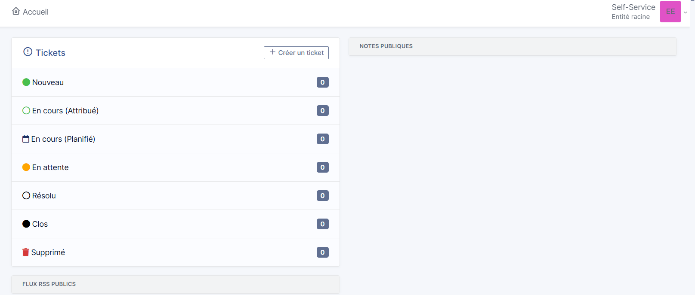
### 4.3 — Créer un ticket depuis le portail

Cliquer sur **+ Créer un ticket** et remplir le formulaire.


### 4.4 — Résolution du ticket par TechnicienParis

Se connecter avec `TechnicienParis` → aller dans **Assistance → Tickets** → ouvrir le ticket → ajouter une solution et clore le ticket.

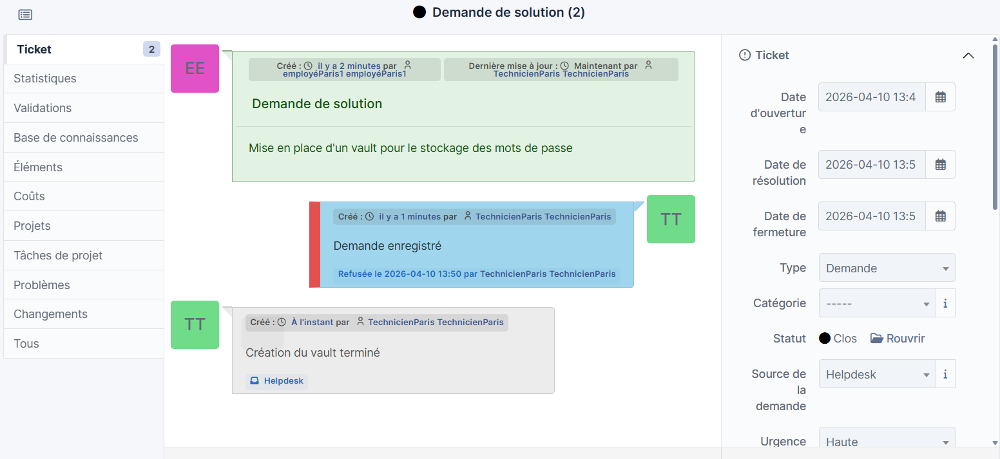


### 4.5 — Tickets créés par les employés Lyon

Chaque self-service Lyon crée un ticket. Vérifier qu'ils apparaissent bien dans l'entité Lyon.

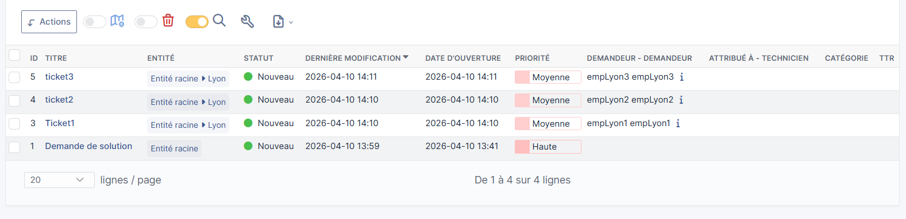


## Partie 5 — Niveau 4 : Catégories ITIL et règles d'affectation

### 5.1 — Créer les catégories ITIL dans l'entité Paris

**Configuration → Intitulés → Catégories de tickets → Ajouter**

Créer les 4 catégories suivantes en sélectionnant l'entité **Paris** :

| Catégorie | Description |
|---|---|
| `Réseau` | Incidents liés au réseau (switch, Wi-Fi, VPN) |
| `Logiciel` | Problèmes applicatifs et système |
| `Matériel` | PC, imprimantes, périphériques |
| `Comptes et droits` | Création de comptes, réinitialisation de mots de passe |

### 5.2 — Créer la règle d'affectation automatique

**Administration → Règles → Règles d'affectation des tickets → Ajouter**

**Informations générales :**

| Champ | Valeur |
|---|---|
| **Nom** | `Affectation Réseau → TechnicienParis` |
| **Entité** | `Paris` |
| **Actif** | `Oui` |

**Critère :**

| Critère | Condition | Valeur |
|---|---|---|
| `Catégorie` | `est` | `Réseau` |

**Action :**

| Action | Opération | Valeur |
|---|---|---|
| `Technicien assigné` | `Assigner` | `TechnicienParis` |

### 5.3 — Tester la règle avec employe2Paris

Se connecter avec `employéParis2` → créer un nouveau ticket :

| Champ | Valeur |
|---|---|
| **Type** | `Incident` |
| **Catégorie** | `Réseau` |
| **Urgence** | `Moyenne` |
| **Titre** | `Problème réseau` |
| **Description** | `Problème de switch` |

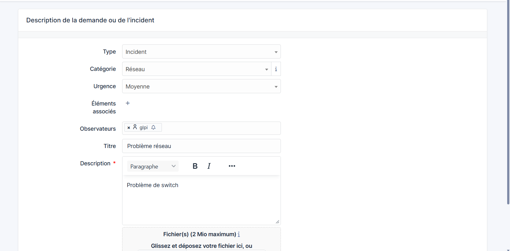

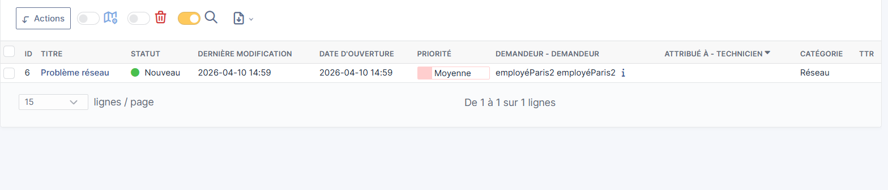

## Résumé du cycle de vie d'un ticket

```
Création (Self-Service)
        ↓
Nouveau
        ↓
Attribution automatique (règle d'affectation)
        ↓
En cours (Attribué)
        ↓
Résolution (Technicien)
        ↓
Résolu
        ↓
Clôture
        ↓
Clos
```


## Tableau récapitulatif des utilisateurs créés

| Utilisateur | Profil | Entité |
|---|---|---|
| `TechnicienParis` | Technician | Paris |
| `employéParis1` | Self-Service | Paris |
| `employéParis2` | Self-Service | Paris |
| `techLyon1` | Technician | Lyon |
| `techLyon2` | Technician | Lyon |
| `empLyon1` | Self-Service | Lyon |
| `empLyon2` | Self-Service | Lyon |
| `empLyon3` | Self-Service | Lyon |
